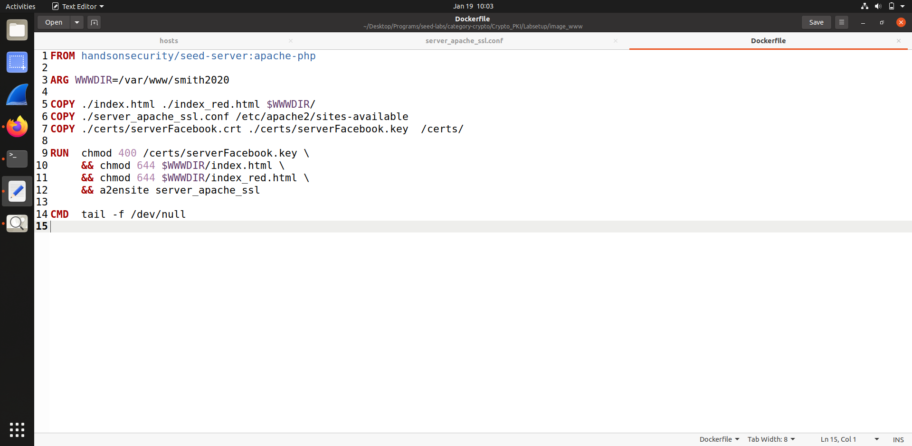

# TASKS
## 1  Becoming a Certificate Authority (CA)
O objetivo desta tarefa é gerar, como root, um certificado CA. Para tal, seguimos os vários passos
do lab:
- Alterar o ficheiro openssl.conf
- Criar os ficheiros index.txt e serial e o diretório demoCA
- Correr o comando `openssl req -x509 -newkey rsa:4096 -sha256 -days 3650 -keyout ca.key -out ca.crt \-subj "/CN=www.modelCA.com/O=Model CA LTD./C=US" -passout pass:dees ` 

Para analisar o conteúdo do certificado corremos os comandos `openssl x509 -in ca.crt -text -noout` e
`openssl rsa -in ca.key -text -noout`.
Conseguimos verificar que se trata de um certificado CA através do `CA: TRUE`.
Como o `Subject key identifier` e o `Authority Key identifier` são iguais, trata-se de um `self-signed certificate`.


O expoente público e privado (e, d), o módulo (n), e os dois números secretos p e q são expostos na consola quando
é corrido o segundo comando, como podemos observar na imagens a seguir.


## 2 Generating a Certificate Request for Your Web Server
Nesta tarefa em vez de gerar um certificado CA, é nos pedido para gerar um pedido de certificado para um servidor Web.
O comando que gera o pedido é igual ao comando da tarefa anterior, diferindo na opção -x509:

`openssl req -x509 -newkey rsa:4096 -sha256 -days 3650 -keyout ca.key -out ca.crt \-subj "/CN=www.modelCA.com/O=Model CA LTD./C=US" -passout pass:dees -addext "subjectAltName = DNS:www.bank32.com,
DNS:www.bank32.pt,
DNS:www.bank32.org"`

Quando corremos os comandos 

`openssl req -in server.csr -text -noout` e `openssl rsa -in server.key -text -noout`,

 o output é o seguinte:

Verifica-se que não é um certificado CA e que o Subject e o Authority identifier são diferentes.

## 3 Generating a Certificate for your server
Feito o pedido do certificado, nesta tarefa vamos converter o pedido num certificado X509 usando o ca.crt e o ca.key gerados anteriormente.

`openssl ca -config myCA_openssl.cnf -policy policy_anything \
-md sha256 -days 3650 \
-in server.csr -out server.crt -batch \
-cert ca.crt -keyfile ca.key`


Podemos verificar, após correr o comando `openssl rsa -in ca.key -text -noout`, conseguimos verificar que foi gerado um certificado com os dados inseridos no pedido como por exemplo: ST = Porto, O = Tiago Silva, etc. Trata-se de um certificado com 10 anos de validade, não é CA e contém os nomes alternativos contidos no pedido da task anterior `www.bank32.pt www.bank32.org www.bank32.com`.

## 4 Deploying Certificate in an Apache-Based HTTPS Website
Após configurar o ficheiro apache_ssl e o dockerfile como indicam as imagens abaixo apresentadas.


Foi possível lançar o nosso server `HTTPS` com os comandos
```
# a2enmod ssl // Enable the SSL module
# a2ensite bank32_apache_ssl // Enable the sites described in this file
// Start the server
# service apache2 start
```
Na shell da imagem docker que corremos.

Sendo por isso lançado o nosso servidor que pode ser acedido através dos três url's diferentes que foram adicionados nos passos anteriores. Como pode ser observado na imagem


No entanto, é notório que o browser não deixa navegar o site, alegando um possível problema de segurança e indicando o erro `SEC_ERROR_UNKNOWN_ISSUER`, ou seja, o emissor do certificado (neste caso nós), não é reconhecido pela mozilla.
Para contornar o problema teremos de adicionar o nosso certificado ao conjunto de certificados vistos como `seguros`, para isso teremos de ir a `about:preferences#privacy` e dar load do nosso `CA certificate` como indica a figura


Após o passo anterior já conseguimos aceder aos diferentes sites sem ser levantado nenhum problema


E se abrirmos as `Authorities` cujos certificados são tidos como seguros podemos observar o `CA certificate` que adicionamos.


## 5 Launching a Man-In-The-Middle Attack
Nesta _task_ escolhemos o `www.facebook.com` como o nosso `website` alvo:


Seguindo os passos que nos foram dados no enunciados, de forma a simularmos um `DNS cache poisining attack`, apenas modificamos o ficheiro `/etc/hosts` mapeando o `hostname www.facebook.com` para o nosso servidor malicioso:


Porém, quando iniciámos o servidor e visitamos o website, o resultado obtido foi o seguinte:


Ou seja, como utilizámos as configurações anteriores, apenas alterando o atributo `ServerName` do ficheiro de configuração do servidor Apache, não iremos ter qualquer certificado que valide o nome `www.facebook.com`, de forma a que o browser não confie neste website.

## 6 Launching a Man-In-The-Middle Attack with a Compromised CA
Para conseguir completar esta _task_ com sucesso, tivemos que arranjar forma de fazer com que o browser não dê o aviso de erro. Para isso, tivemos que gerar certificados para o website alvo (`www.facebook.com`):

Tal como nas _tasks_ anteriores, tivemos de fazer o pedido do certificado:


E depois gerámo-lo:


Com os certificados já gerados, tivemos de alterar as configurações do docker file, para que este os utilizasse:



Faltando-nos apenas mudar o ficheiro de configuração do _server apache_ de forma a que este também os utilizasse:


E desta forma, iniciando o _server apache_ obtivemos o seguinte resultado:


Deste modo, com a resolução desta _task_, observamos que apesar de termos gerado os certificados e termos resolvido o problema da _task_ anterior, o browser reconhece que o emissor dos certificados não é de confiança e lança um aviso que pode passar despercebido, o que pode levar a que este ataque tenha sucesso, no caso do utilizador não se aperceber do que está a acontecer.
