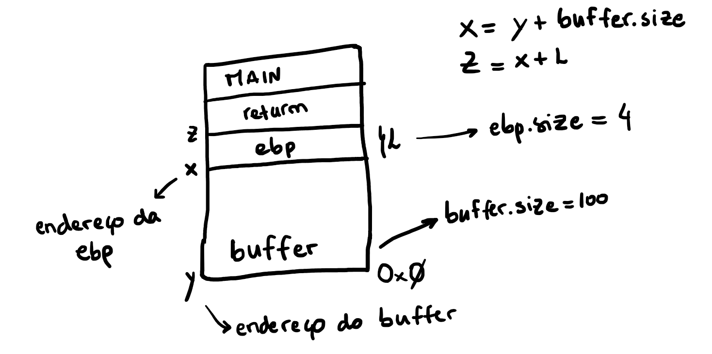

# Trabalho realizado na Semana #5

## Task 1
Nesta tarefa observamos que o programa cria uma shell, seja usando código de 32 ou de 64 bits, isto é feito escrevendo o código na stack, através da variavel code que pode ser executada devido à opção `execstack` estar ativada.

## Task 2
O programa apresentado contém uma vulnerabilidade de `Buffer Overflow`, ele lê uma string de tamanho 517 um ficheiro chamado `badfile`, essa string é passado como argumento para a função bof que aloca um `buffer` de 100 bytes e utilizando a função `strcpy` copia o conteúdo da string que recebe para o buffer. Como o `strcpy` não verifica limites, ocorre o `Buffer Overflow`. Como o programa é `SET-UID`e o seu dono é root e quem controlo o ficheiro `badfile`é o user, o user pode ganhar acesso à root shell. 

## Task 3
Utilizando o programa de debug, foi nos permitido obter o o endereço  do buffer e o valor do ebp (podendo assim chegar ao valor do `return adress` somando 4). Assim podemos colocar o nosso shellcode no `buffer` e escrever no return adress o endereço do buffer, fazendo com que, quando sair da função, o programa salte para o sitio onde está o shellcode fazendo com que este seja corrido. Esta tarefa foi facilitda através do uso do script `exploit.py` alterando as variáveis `shellcode` para o codigo que pretendemos utilizar, `ret` para o endereço do buffer e `offset` para a diferença entre o `return adress` e o endereço do buffer. 

 Figura 1: Representação da stack.

## CTF
### Desafio 1
Após a elaboração do lab, esta CTF tornou-se simples, pois foi um replicar dos conhecimentos que tivemos na aula prática. Para completarmos este desafio, apenas necessitamos de dar _overflow_ a `buffer` que apenas possuia um tamanho de 20. Assim, apenas foi necessário colocar 20 caracteres aleatórios seguidos do nome do ficheiro que queriamos abrir (que iria subscrever o endereço imediatamente a cima do espaço alocado para `buffer`): `flag.txt`. Isto só é possível, pois o programa faz uma leitura de 28 caracteres para `buffer`através de `scanf("%28s", &buffer);`, sendo esta a vulnerabilidade do código.
### Desafio 2
Já nesta CTF, para além de subscrever a variável `meme_file` (com o valor `flag.txt`), também tinhamos de subscrever `val`(com o valor `0xfefc2122`). Deste modo, tal como no desafio anterior, e com a ajuda de um programa que nos gerava o _input_, apenas tivemos de passar uma _string_ do género: `aaaaaaaaaaaaaaaaaaaa\x22\x21\xfc\xfeflag.txt` para o programa nos dar o valor da flag.
